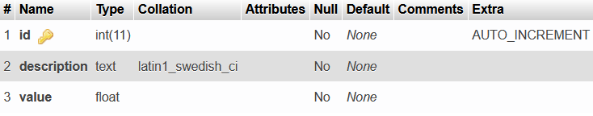

# API rest con express

Genera una conexión a una base de datos **MySQL** en local y realiza las operaciones CRUD sobre una tabla específica.

## ¿Qué necesito para usar el proyecto?
Asumiendo que ya tiene [node](https://nodejs.org/en/) y el transpilador de [typescript](https://www.typescriptlang.org/download) instalados, los requerimientos son los siquientes:

Una base de datos **MySQL** de prueba con una tabla de nombre `products` con las siguientes propiedades:
<p align="center">
  
</p>

La instrucción **SQL** para crearla es la siguiente:

```SQL
CREATE TABLE products(
    id INT(11) NOT NULL AUTO_INCREMENT,
    description TEXT NOT NULL,
    value FLOAT NOT NULL,
    imagePath TEXT NOT NULL,
    PRIMARY KEY (id)
)
```
La información necesaria para establecer la conexión se configura en `config/.env`.

## Usar el proyecto

Una vez iniciado **MySQL**, al ejecutar el comando que se muestra abajo en la raíz del proyecto debería mostrarse un mensaje como `server init in port 3000`, en caso de que todo funcione correctamente:
```Bash
npm run build
```
Luego de esto ya se pueden efectuar peticiones a la API en `localhost:3000/` desde cualquier cliente HTTP.

## Peticiones

- **GET**: se realiza al siguiente path `products/:id`, donde id es un número entero que representa la llave primaria del producto solicitado.
- **POST**: el path es `products/` y el cuerpo de la petición es un objeto JSON con las propiedades `description` y `value`, los tipos de datos son `string` y `number`, respectivamente.
- **PUT**: el path es `products/:id`, id significa lo mismo que con el método **GET**, el cuerpo de la petición es un objeto igual al de **POST**.
- **DELETE**: el path es `products/:id`, id es lo antes mencionado.
